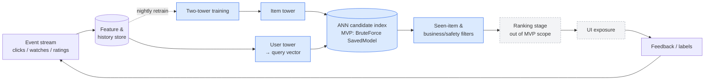

# Two-Tower Movie Retrieval — MovieLens 100K

[](https://github.com/Sayomphon/Two_Tower_Movie_Retrieval/actions/workflows/ci.yml)
[](https://colab.research.google.com/github/Sayomphon/Two_Tower_Movie_Retrieval/blob/main/notebooks/movielens_two_tower_retrieval.ipynb)

Candidate-retrieval system that takes a `user_id` and returns Top-K movie candidates,
built end-to-end with production-style engineering discipline: temporal evaluation,
leakage audits, a popularity baseline, bias/coverage guardrails, and an exportable,
version-stamped serving index with a cold-start fallback.

> **Portfolio project** — demonstrates the *retrieval* stage of a modern recommender
> (retrieval → ranking → re-ranking), the stage that narrows a large catalogue to a few
> hundred candidates under tight latency budgets.

## Problem

Platforms with large catalogues cannot score every item with an expensive ranking model on
every request. A retrieval layer must return relevant candidates fast, and its **offline
evaluation must mirror serving reality**: predicting *future* interactions from *past*
ones. A random train/test split leaks the future and inflates every metric — so everything
here is evaluated with a **temporal leave-last-1-out split per user**, enforced by an
automated leakage audit that fails the pipeline on violation.

## Approach

```
ratings ──► data contract ──► temporal split (audited) ──► popularity baseline (R0)
   (SHA-256 verified download)        │
                                      └──► two-tower model (R1/R2) ──► full-catalogue eval
                                                    │                   Recall/NDCG/coverage/bias/slices
                                                    └──► brute-force SavedModel index
                                                         + seen-filter + popularity fallback
```

- **Model**: two-tower `user_id`/`movie_id` embeddings (dim 32), dot-product affinity,
  **in-batch sampled softmax** with accidental-hit masking — implemented in ~60 lines of
  pure TensorFlow/Keras 3 (TFRS is in maintenance mode and Keras-3-incompatible; owning the
  loss keeps the dependency surface small and the math auditable).
- **Selection discipline**: R1 (dim 32) vs R2 (dim 64) compared on **validation** Recall@10
  only; the test set is scored exactly once, after all decisions.
- **Serving**: pure-TF SavedModel index (no Keras dependency), reload-consistency checked at
  export time, input validation, seen-item filtering, and `model_version`/`index_version`
  stamped into every response.

## Where this sits in a production recommender



*Blue = built here · dashed grey = designed but outside the 10-hour scope.* The arrow from
exposure back to the event stream is why coverage and popularity bias are tracked as
first-class metrics: today's recommendations become tomorrow's training labels.

## Results (temporal test set, 943 users, full-catalogue scoring)

| metric @10 | popularity (R0) | two-tower (R1) |
|---|---|---|
| Recall@10 | **0.066** | 0.058 |
| NDCG@10 | **0.033** | 0.027 |
| Recall@50 | 0.183 | **0.231** |
| Catalogue coverage@10 | 5.4% | **89.3%** |
| Top-10%-popular share of slots | 100% | **6.3%** |
| Gini exposure | 0.99 | **0.48** |

**Honest headline:** the popularity baseline edges out the ID-only two-tower model at K=10 —
a well-known result on small temporal datasets — while the two-tower model wins at K=50
(the regime that matters for a retrieval stage feeding a ranker) and delivers **~16× higher
catalogue coverage** with drastically lower popularity concentration. Slice analysis shows
the model is strongest exactly where popularity fails: long-tail test items (2.6× head
recall) and low-history users. Conclusions are stable under the positive-interaction-rule
sensitivity check (`rating ≥ 4` vs all ratings). Serving latency: **p95 ≈ 1 ms** per
single-user query on a laptop CPU (the exact figure moves with machine load —
`artifacts/metrics.json` carries the value from the run reported here).

## Quickstart

```bash
python3.11 -m venv .venv && source .venv/bin/activate
pip install -e ".[dev]"                # package + CLI + test/notebook tooling

movie-retrieval all --sensitivity      # download → validate → split → train → evaluate → export
movie-retrieval recommend --user-id 42 --k 10
pytest                                 # 62 tests incl. leakage & zip-slip guards
```

Three dependency files, three different jobs — complements, not duplicates:

| file | pins | use it when |
|---|---|---|
| `pyproject.toml` | version *ranges* + the `movie-retrieval` console script | installing the project itself (**recommended**) |
| `requirements.txt` | the same runtime ranges plus notebook deps, no package install | you only need the libraries — a bare Colab/CI runtime |
| `requirements-lock.txt` | exact resolved versions of the run reported above | reproducing the published metrics bit-for-bit |

The dataset (~5 MB) is downloaded at runtime from GroupLens and verified against a pinned
SHA-256. It is **never committed** (MovieLens research-use terms prohibit redistribution).

## Repository layout

```
├── src/movie_retrieval/      # config, data, splits, baseline, model, evaluate, index, pipeline, cli
├── tests/                    # unit + integration tests (leakage, metrics, index reload, security)
├── notebooks/movielens_two_tower_retrieval.ipynb   # 19-section narrative notebook (executed)
│   └── ..._Colab_Ran.ipynb   # same notebook, executed top-to-bottom on a clean Colab runtime
├── docs/                     # model card, development log, interview prep, project status
├── .github/workflows/ci.yml  # ruff + pytest on Python 3.11 / 3.12
├── artifacts/                # generated: model, index, vocab, metrics (gitignored)
├── requirements.txt          # runtime + notebook dependency ranges
└── requirements-lock.txt     # frozen dependency versions (exact reproduction)
```

## Key engineering decisions

1. **Temporal leave-last-k split with hard audit** — `LeakageError` stops the run on any
   future leakage, missing history, or train/test overlap; split rule is versioned in
   `artifacts/split_config.json`.
2. **Train-only statistics** — vocabularies and popularity counts never see val/test; OOV
   test items are reported (0.2%), not silently dropped.
3. **SUM loss reduction** (TFRS semantics) — with MEAN reduction, per-parameter gradients
   are ~batch-size smaller and Adagrad stalls; a subtle bug that presents as "flat loss".
4. **Full-catalogue evaluation** — 1,682 items makes exact scoring cheap; no
   sampled-negative bias in reported metrics.
5. **Fail-hard artifact export** — export aborts unless the reloaded index reproduces the
   in-memory Top-K exactly.
6. **Security hygiene** — HTTPS + pinned SHA-256 download, zip-slip-safe extraction,
   input validation at the serving API, no secrets/data in the repo.

## Interview notes

[`docs/interview_prep.md`](docs/interview_prep.md) — a 90-second pitch, the seven standard
retrieval design questions (retrieval vs ranking, why not RMSE, temporal splits, negative
sampling, cold start, brute force vs ANN, limits of offline scoring), and the harder ones
*this* project's results invite: why the popularity baseline wins at K=10, whether that gap
is even significant, and what would actually close it. Every figure quoted there comes from
the same run as the tables above.

## Limitations

- No impression data: unobserved ≠ disliked; offline Recall is a proxy — only an online
  A/B test measures real lift.
- 1998-era, 100K-interaction dataset: methodology transfers, taste conclusions don't.
- One test interaction per user → K=10 differences of ±0.01 are noise-level.
- ID-only towers cannot embed new movies (item cold-start) — needs content features
  (title/genre tower), listed as the first stretch goal.

## License & data terms

Code: MIT. Dataset: [MovieLens 100K](https://grouplens.org/datasets/movielens/100k/) by
GroupLens — research use only, no redistribution, no commercial use; downloaded at runtime
and excluded from version control.
